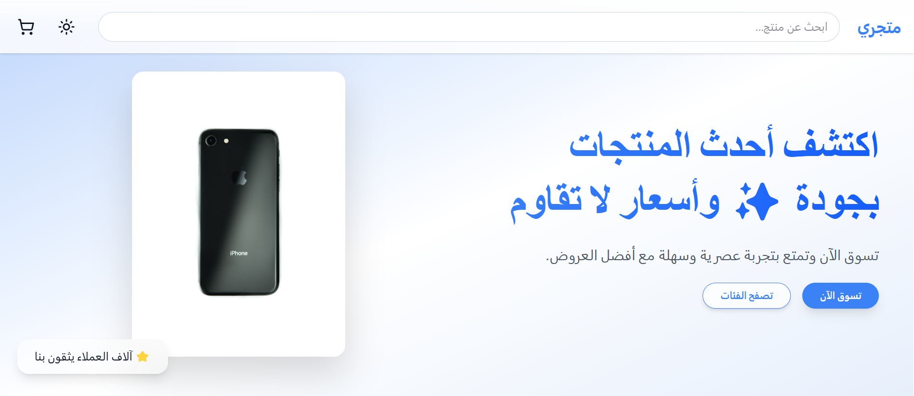
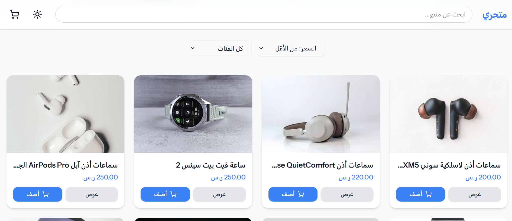
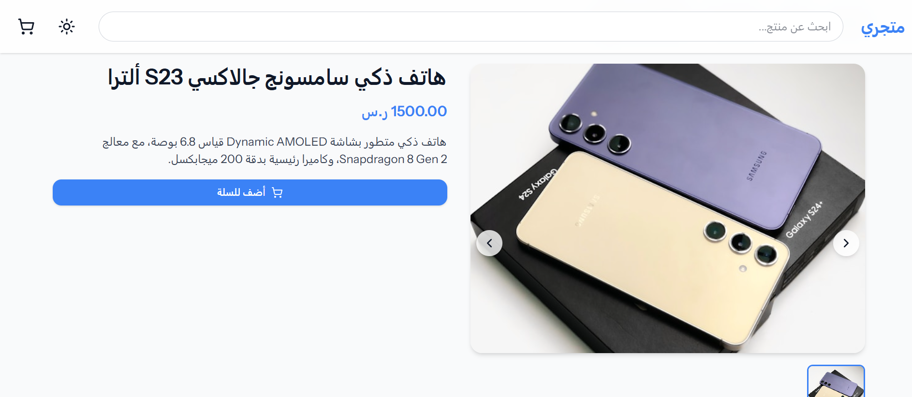

# Small Ecommerce Store

A modern Arabic ecommerce store showcasing products with a shopping cart, simulated checkout, and a sleek RTL design.

**Technologies Used:**

- **Backend:** Laravel 12
- **Frontend:** Vue 3 + Inertia.js
- **State Management:** Pinia
- **UI Components:** Tailwind CSS + shadcn/ui
- **Animations:** motion-v
- **Icons:** lucide-vue-next
- **Notifications:** vue-toastification

---

## 💡 Key Features

- Display products with images and prices
- Add/remove products from the cart
- Simulated checkout
- Dynamic product search & filtering
- Sort products by price or category
- Live cart total updates
- Toast notifications for cart actions
- RTL, modern, portfolio-ready design

---

## 🚀 Demo

You can check out the live demo here:  
👉 [Live Demo](https://modern-arabic-store.onrender.com)

> ⚠️ Demo uses mock data and a simulated checkout flow for presentation purposes only.

---

## 📸 Screenshots

### Homepage




### Category Page


### Product Page



### Cart Drawer


### Checkout


---

## 🖼 Pages Included

- **Homepage:** Product listing, Hero section, Filters
- **Product Page:** Image gallery, product details, add-to-cart
- **Category Page:** Filter products by category
- **About Us Page:** Hero section, mission & vision, company values
- **Contact Page:** Contact form with validation & toast notifications

---

## ⚡ Running Locally

### Requirements

- PHP >= 8.1
- Composer
- Node.js >= 18
- MySQL / SQLite / PostgreSQL

### Steps

```bash
# Clone the repository
git clone https://github.com/harranali/modern-arabic-store.git
cd modern-arabic-store

# Backend (Laravel)
composer install
cp .env.example .env
php artisan key:generate
# Configure database in .env
php artisan migrate --seed

# Frontend (Vue 3 + Inertia)
npm install
npm run dev

# Run the server
php artisan serve
```
